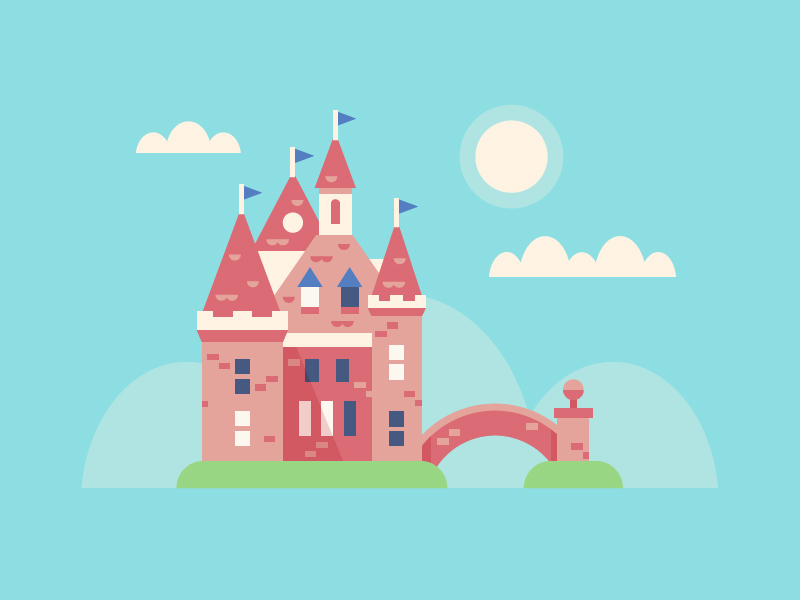

# The Bolt Castle

### A fun project of mine where I turned an image to pure code with only HTML&CSS (SCSS to be precise).

The image comes from a great graphic designer [Scott Tusk](https://dribbble.com/Tusk). It took me about 12 working hours to code it. It was great fun but I also mastered my SCSS skills ;) I used Gulp as a big help (live reload, autoprefixer and SASS to CSS compiler).

#### [Live preview](https://mkupiniak.github.io/The_Bolt_Castle/)

Here is the image:

